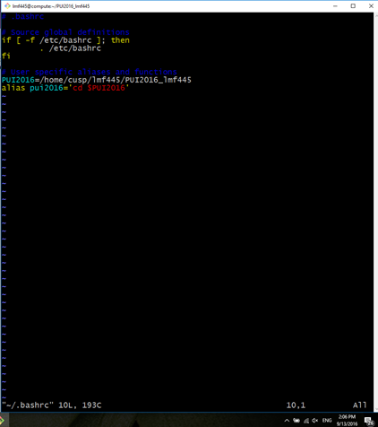
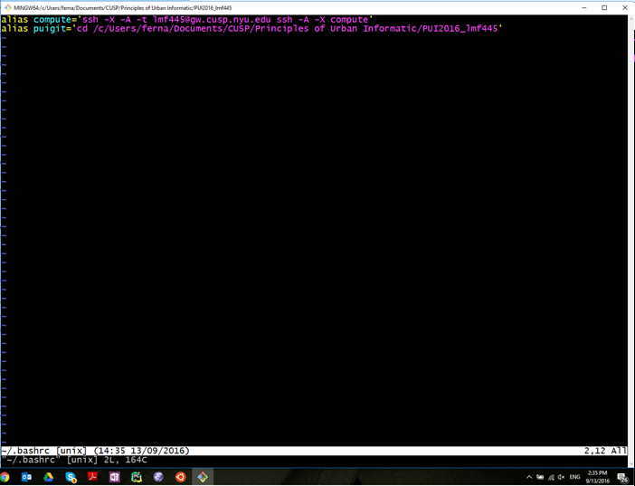
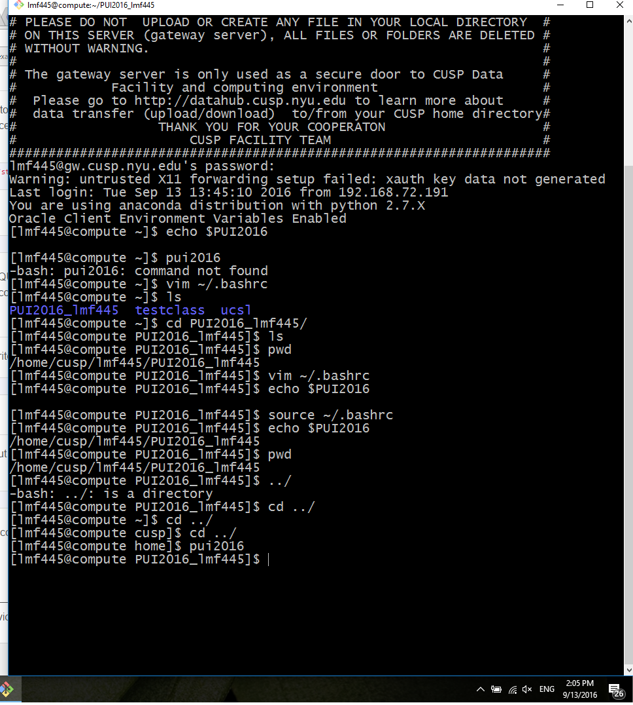

#Decription of PUI2016 HW 1
# PUI 2016 HW 1.  

##https://github.com/fernandomelchor/PUI2016_lmf445

# Assignment 1: Finish Lab 1

## Finish the lab started in the first lab session if you have not in class:

###Here you can find myfirstfile.txt that I pushed from my computer to my github repository.
https://github.com/fernandomelchor/gittest_lmf445/blob/master/myfirstfile.txt
### During my work on creation of the first file I experienced some problems when trying to fix the merge conflict at the end I realized I was using "git commit myfirst file" instead of "git commit" without the name of the file. That is why I did the excersise witht he file several time that cna be monitored at the commits record.

##Fork
###For the fork excercise I cloned Sebastian's repo and sent him a Pull Request, even though he already had done it, but he was so kind to redo it to help me, Thnx Sebastian.
###After that I was trying to test solving a merge with Enrique jsut for testing and it went wrong , I am working to solve that one.
https://github.com/fernandomelchor/gittest_sbg389

# Assignment 2: Set up your environment

##1. Create PUI2016_lmf445 Directory
     	    [lmf445@compute PUI2016_lmf445]$ pwd
	    /home/cusp/lmf445/PUI2016_lmf445
	    [lmf445@compute PUI2016_lmf445]$

##2. Create evironmental variable PUI2016 with the address of the directory that we just created
     	    [lmf445@compute PUI2016_lmf445]$ echo $PUI2016
	    /home/cusp/lmf445/PUI2016_lmf445
	    [lmf445@compute PUI2016_lmf445]$

##3. Create an alias with a cd comand anthe environmental variable PUI2016
     	    [lmf445@compute home]$ pwd
	    /home
	    [lmf445@compute home]$ pui2016
	    [lmf445@compute PUI2016_lmf445]$ pwd
	    /home/cusp/lmf445/PUI2016_lmf445 

##4. Screenshot of my .bashrc

##bashrc in COMPUTE

##bashrc LOCAL

##6. Screenshot of alias use

##7. Create PUI2016_lmf445
https://github.com/fernandomelchor/PUI2016_lmf445

##8. Create a directory HW1_lmf445 inside PUI2016_lmf445
https://github.com/fernandomelchor/PUI2016_lmf445/tree/master/HW1_lmf445

##9. Create this README.MD file 
Here I am.